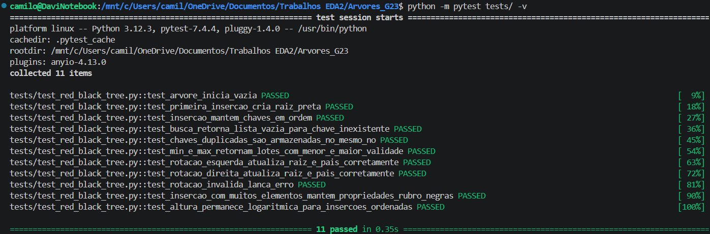
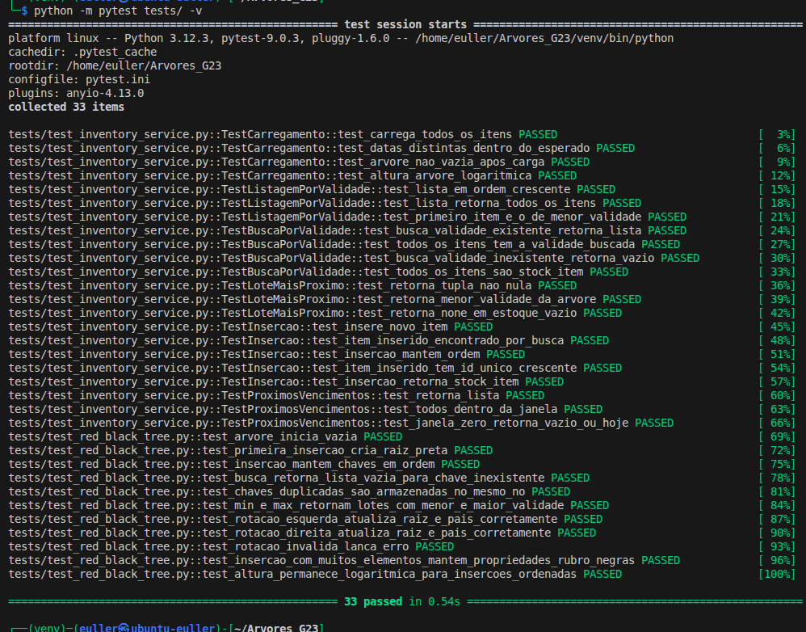
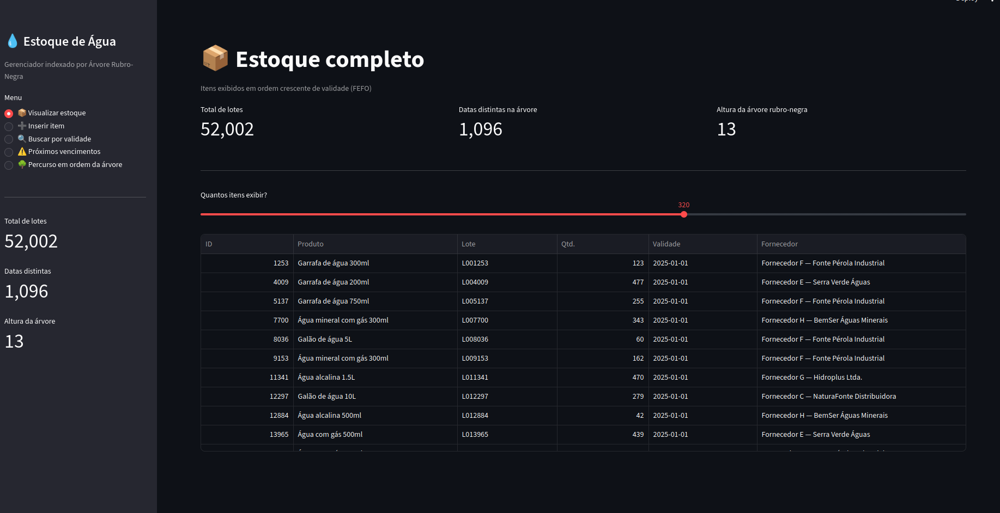
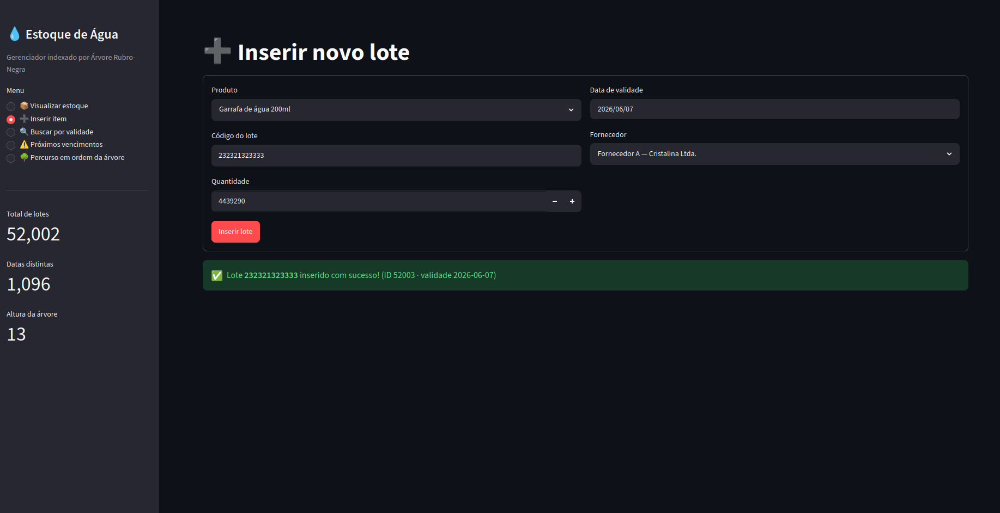
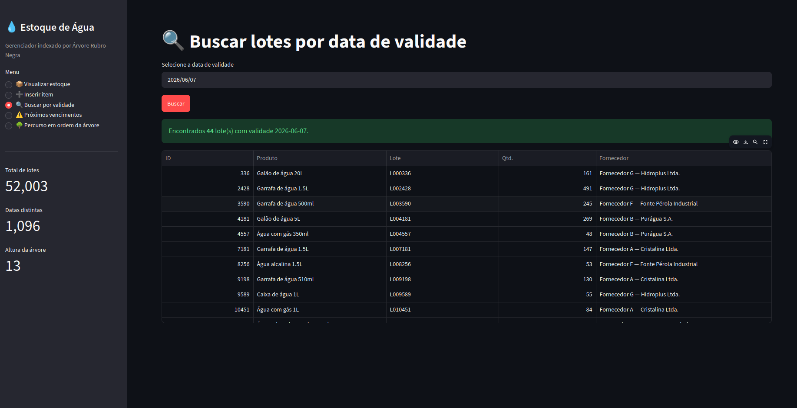
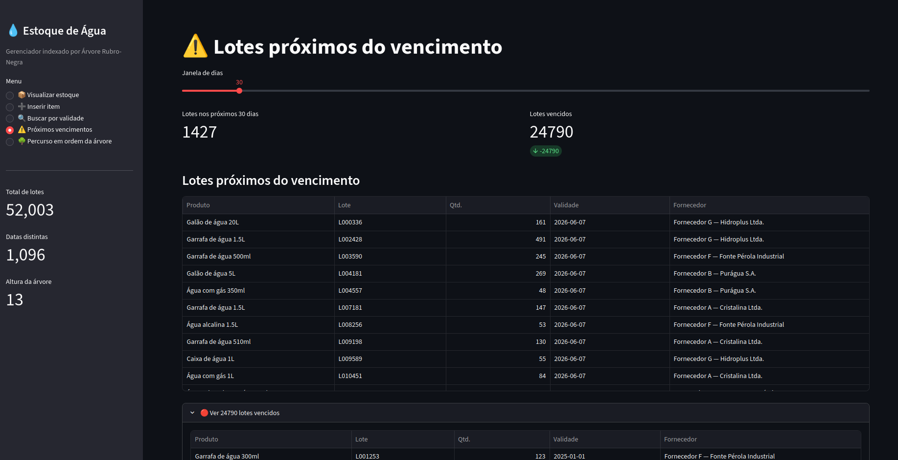
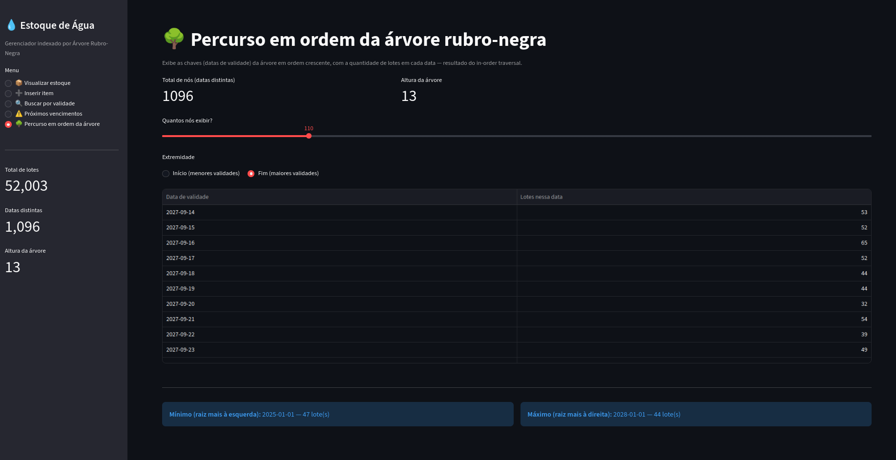
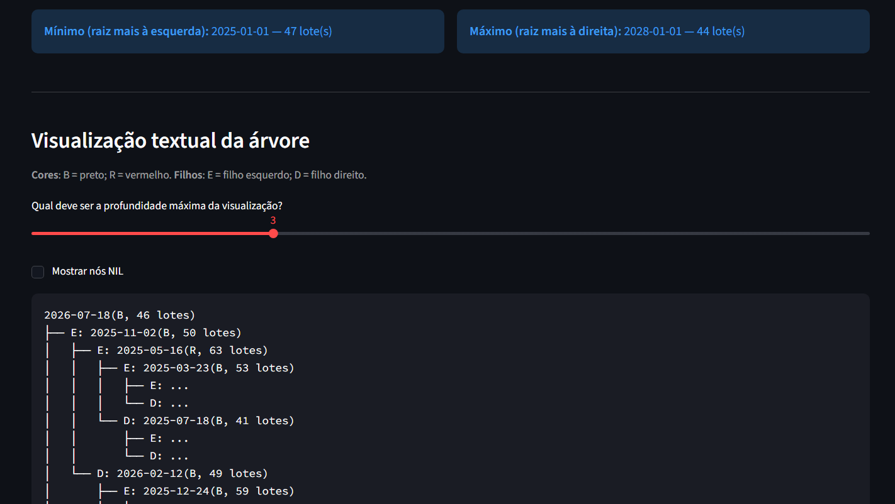

# Gerenciador de Estoque de Água

**Número da Lista**: 3<br>
**Conteúdo da Disciplina**: Árvores<br>

## Alunos
| Matrícula | Aluno |
| -- | -- |
| 23/1011220  |  Davi Camilo Menezes |
| 23/1026714  |  Euller Júlio da Silva |

## Apresentação do trabalho
[Link para o vídeo de apresentação](https://youtu.be/xFLADZ4Ua9s)

## Sobre
O **Gerenciador de Estoque de Água** é uma aplicação desenvolvida para controlar lotes de água a partir da data de validade. O objetivo do projeto é simular um cenário real de estoque, no qual é importante identificar rapidamente quais produtos vencem primeiro, buscar lotes por validade e listar os itens seguindo o princípio FEFO (*First Expired, First Out*).

Para isso, o sistema utiliza uma **Árvore Rubro-Negra** como estrutura de índice ordenado. A chave da árvore é a data de validade dos lotes, no formato `YYYY-MM-DD`, onde como vários lotes podem possuir a mesma validade, cada nó da árvore armazena uma lista de itens associados àquela data.

A aplicação carrega dados mock de estoque, transforma cada registro em um `StockItem` e insere esses itens na árvore por meio do serviço de inventário. A partir disso, o usuário pode visualizar o estoque, buscar lotes por validade, listar os produtos em ordem crescente de vencimento, consultar o lote mais próximo do vencimento e visualizar textualmente a estrutura da árvore, incluindo as cores dos nós e sua organização interna.

## Screenshots
A seguir estão as imagens dos testes do projeto. As demais imagens do projeto em funcionamento (incluindo sua interface) estão na seção de **Uso**.

### Execução local dos testes



Para garantir que a implementação da Árvore Rubro-Negra está funcionando como esperado, foram criados testes automatizados em `test_red_black_tree.py`, validando pontos como a inserção de lotes, o balanceamento da árvore, as rotações, a busca por chave, o percurso em ordem, o tratamento de chaves duplicadas e a preservação das propriedades, onde conforme a imagem, todos foram concluídos com sucesso.



Além disso, foram implementados testes para a camada de serviços em `test_inventory_service.py`, os quais garantem a correta integração do estoque com a árvore. Esses testes validam o carregamento dos mais de 50.000 itens mockados, a recuperação ordenada de lotes (FEFO), a busca por validade, o alerta de vencimentos próximos e a inserção de novos lotes. Como demonstra a segunda imagem, todos os testes de serviço também foram finalizados com êxito.

## Instalação
**Linguagem**: Python<br>
**Framework**: Streamlit<br>
**Pré-requisitos:** Python 3.10+ instalado e `pytest` para rodar os testes<br>

### Como rodar

1. Clonar o repositório para a sua máquina
```bash
git clone https://github.com/eda2-2026/Arvores_Gerenciador-de-estoque-de-agua.git
```

2. Navegar até o diretório do projeto
```bash
cd Arvores_Gerenciador-de-estoque-de-agua
```

3. Instalar as dependências
```bash
python -m pip install streamlit pytest
```

4. Executar a aplicação
```bash
python -m streamlit run app.py
```

5. Rodar todos os testes
```bash
python -m pytest tests/ -v
```

**Observações**
- A aplicação é executada localmente por meio do *Streamlit* e disponibilizada em uma interface web, a qual é aberta automaticamente no navegador.
- Se `python` não estiver disponível no seu terminal, use `python3` nos comandos acima.

## Uso

Após rodar o comando `python -m streamlit run app.py` (ou `python3 -m streamlit run app.py`), o seu navegador padrão será aberto automaticamente, mostrando a interface do sistema. Se isso não ocorrer, você pode acessar pelo link local fornecido no terminal (geralmente `http://localhost:8501`).

A interface é dividida em um **menu lateral** para navegação e a tela principal. O sistema já é inicializado com um estoque de cerca de 52.000 itens de forma dinâmica e local, e as operações são efetuadas e refletidas internamente através da **estrutura da Árvore Rubro-Negra**.

Abaixo, detalhamos o fluxo de uso e cada uma das opções disponíveis no menu.

### 1. Visualizar estoque
Exibe uma tabela contendo os lotes cadastrados no estoque organizados em ordem crescente de validade (princípio de fila FEFO — *First Expired, First Out*). Você pode usar o controle deslizante ("slider") da tela para definir a quantidade de itens consultados. No painel, também é atualizado o panorama atual (totais de estoque e a altura presente da árvore).



### 2. Inserir item
Permite cadastrar a entrada de novos lotes de água. Ao preencher as informações (produto, código do lote, quantidade, validade e fornecedor) e submeter o formulário (em "Inserir lote"), o sistema realiza a inserção do elemento na árvore e executa internamente o rebalanceamento, sempre operando em complexidade de tempo O(log n), mesmo no pior caso. Com isso, o lote estará imediatamente apto para consulta.



### 3. Buscar por validade
Nesta página, você pode pesquisar através do calendário por itens que tenham uma data de vencimento específica. O sistema busca os itens na árvore em complexidade algorítmica de busca O(log n) e rapidamente lista todos os lotes atrelados a ela, ou informa caso não haja resultados.



### 4. Próximos vencimentos
Funcionalidade para gerenciamento de vida útil de produtos. Você pode configurar uma "janela de dias" da busca através de um slider (por exemplo: próximos 30 dias contados a partir da data de hoje), e a funcionalidade devolverá a listagem dos lotes próximos da validade que se encontram nesta margem temporal, além de separar em outra tabela expansível os estoques que já expiraram.



### 5. Percurso em ordem da árvore
Ferramenta para inspecionar os elementos por meio de um percurso em ordem ("in-order traversal"). Com a estrutura da árvore lida de forma sequencial, você poderá checar as chaves e visualizar as quantidades que cada nó aloja. Também é possível exibir de forma particionada entre "Início" e "Fim" de elementos da árvore de forma visual.



Além disso, ao descer a página, você pode ver a árvore representada textualmente, com a indicação da cor de cada nó e da relação entre seus filhos esquerdo e direito, permitindo ainda limitar a profundidade máxima exibida (8 níveis é o máximo para manter a interface legível). Essa visualização ajuda a demonstrar como a Árvore Rubro-Negra mantém os lotes organizados e balanceados internamente, usando a data de validade como chave de ordenação.


